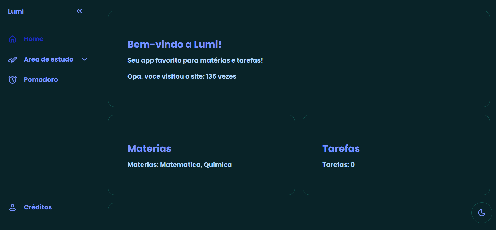

# Lumi - o App de estudos

## Página inicial:

## O que Lumi proporciona?
- Criação de tarefas
- Flashcards digitais
- Versão web compativel com celulares

## Como usar?
- Abra [esse link](https://normynaoexiste.github.io/study-flow/) para utilizar!

## Autores
- Davi Felipe - [NormyNaoExiste](https://github.com/NormyNaoExiste)
- Leonardo Menezes - [leoMnZs](https://github.com/leoMnZs)
- Danielle Heloisa - [Danielle-sys-tech](https://github.com/Danielle-sys-tech)
